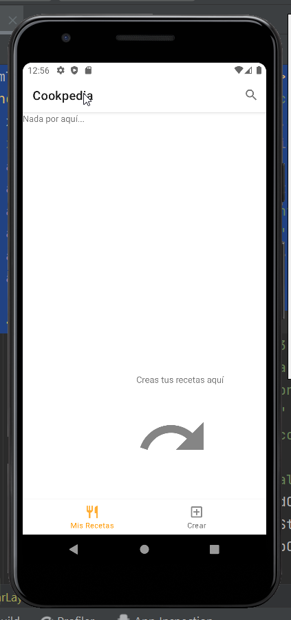
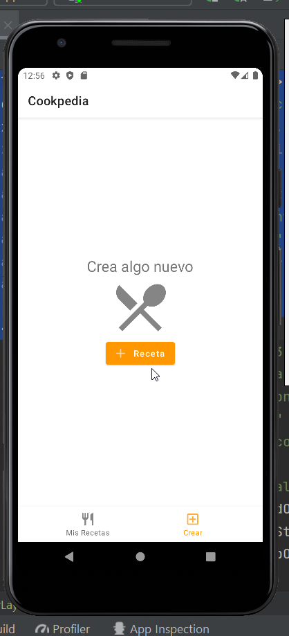
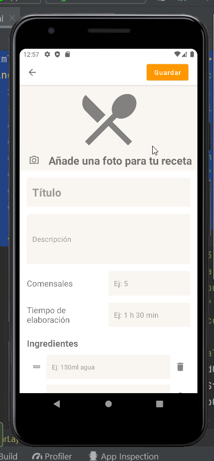
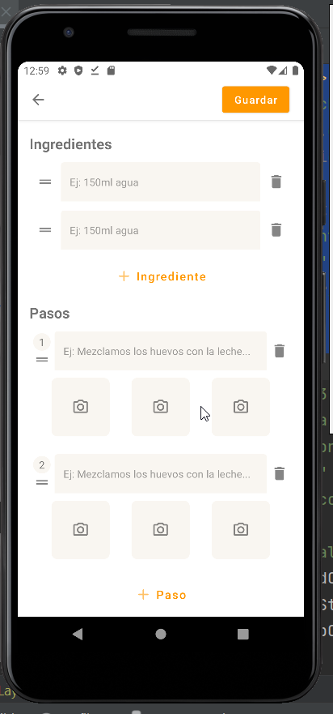
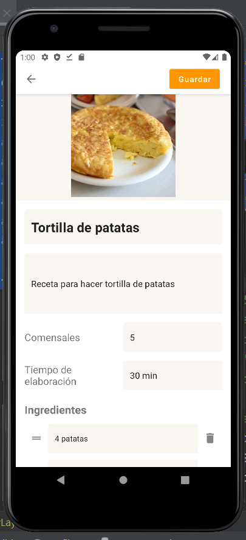
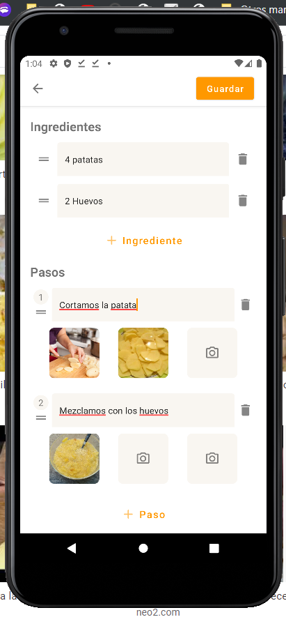
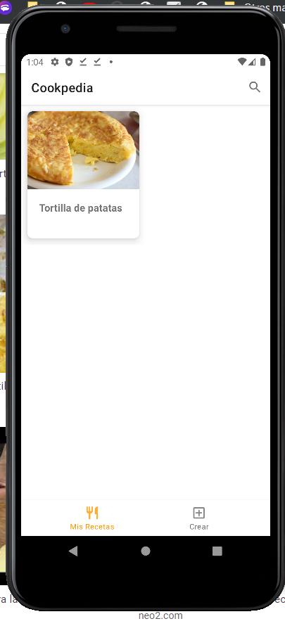
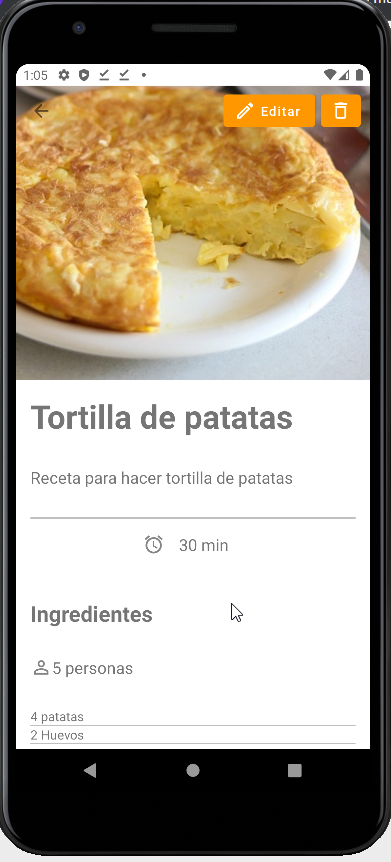
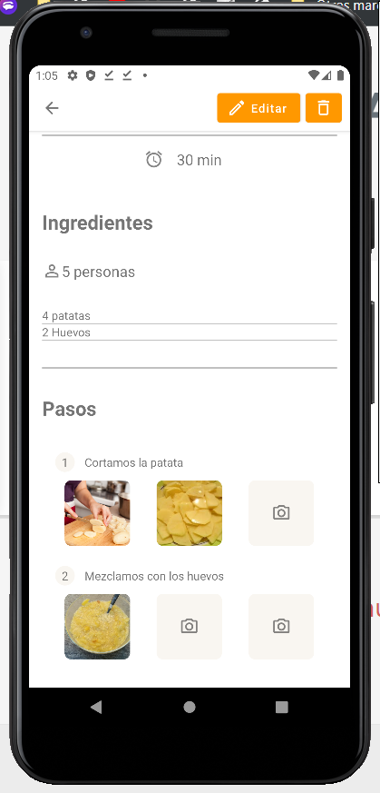

# Cookpedia
Android App - Cookpedia, save your recipes on your phone

Made with <a href="https://developer.android.com/training/data-storage/room">Room</a> Database

MainActivity

CrearRecetaActivity

VerRecetaActivity

